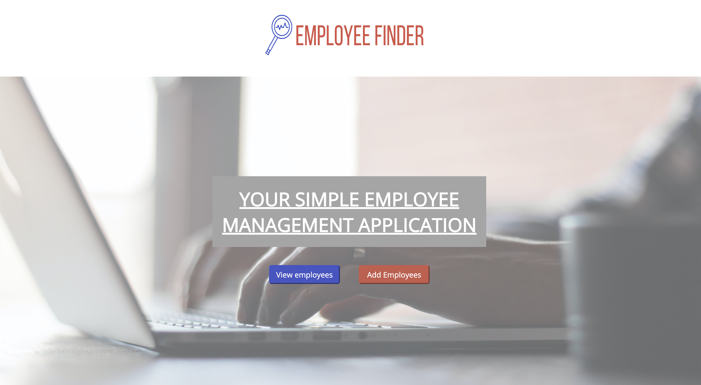
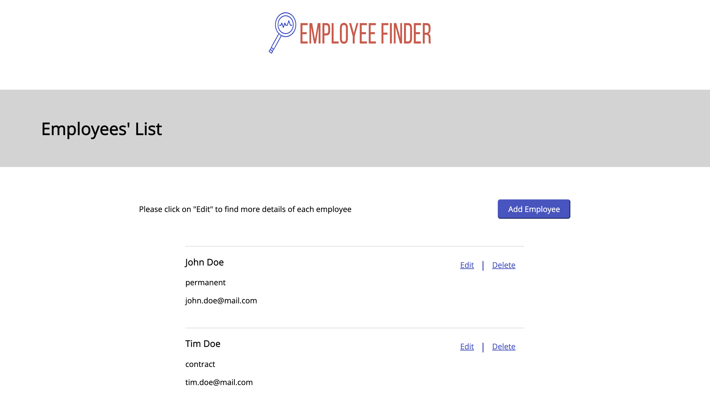
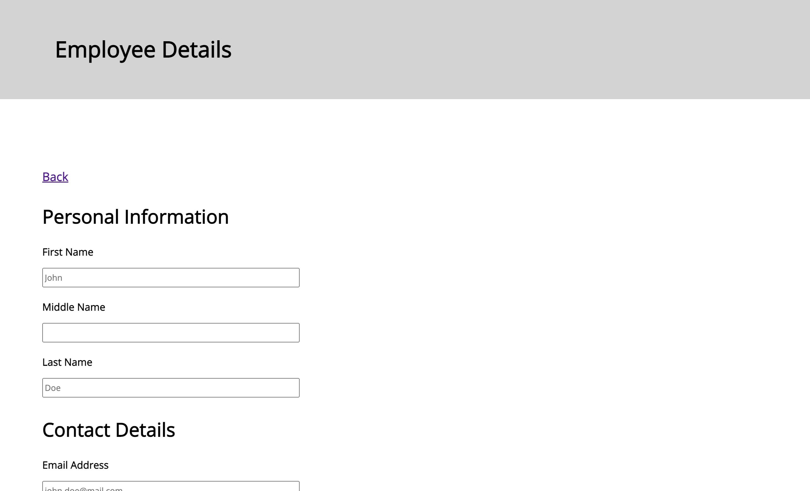

# Employee Full Stack Application

## Demo & Snippets

  
  

---

## Requirements / Purpose

### MVP

Requirements of the project is to create web application that can manage employees by providing features such as creating, listing, modification and deletion. The ideal solution should comprise a RESTful API developed in either .NET Core or any other preferred backend framework, as well as a React-based frontend.

## Purpose of the project

The application should have a page that displays a list of employees, a form that enables users to input details of new employees, the ability to edit existing emloyee records, and the option to delete them.

## Stacks used and why

To build the application, the follow tech stacks have been used:

- React for building the user interface
- Typescript for developing more reliable and manageable code
- SASS for styling the application
- Java with Springboot to build the backend functionality

---

## Build Steps

### Prequisites

To get started, you will need to have Vite, Google Chrom, a VCS, mySQL and Visual Studio Code installed on your system.

### Steps

Here are the steps to set up the project:

1.  Clone the repository to your local machine
2.  Navigate to the "employeeApp/" directory using the Command Line Interface (CLI) and run "npm install" or "pnpm install" followd by "npm run dev" or "pnpm run dev" to install the necessary dependencies and start the development server.
3.  Open the Google Chrome browser and copy the local link provided in the command line into the browser search bar to view the application. Alternatively, press the link directory in the command line to open the browser holding "cmd" on mac or "ctrl" on windows whilst clicking the link.
4.  Run the backend server in Visual Studio Code (installing Springboot and Java extensions if necessary).
5.  Create a new database in mySQL.
6.  Update the "application.properties" file which can be found in "employeeApp-backend/src/main/resources/application.properties" with the following details:  
    dbc:mysql://localhost:3306/  
    username: your mySQL server username  
    password: your mySQL server password

## The application is now ready for use

## Design Goals / Approach

- Design goals
- why did you implement this the way you did?

### Design Goals

The backend architecture follows a generic pattern of layers that includes Entity, Data Transfer Object (DTO), Controller, Repository, and Service. On the front-end, the "New Employee" page will feature a form that users can fill out and submit to add new employees to the database.

The homepage will include a button that leads users to the "Add Employee" page, where they can input employee information. The homepage will also include a "Delete" button that allows users to delete an employee from the database and remove it from the employee list.

### Implementation

Some reasons as to why the above design goals were implemented include:

1.  The use of a layered architecture with Entity, DTO, Controller, Repository, and Service is a common and widely accepted approach to building robust and scalable backends. By separating concerns and responsibilities, each layer can focus on its specific tasks, which makes the application easier to maintain, test, and evolve over time.
2.  The use of a form on the front-end for adding new employees allows for a more user-friendly and intuitive way of collecting employee information. By presenting a clear and structured form, users can easily input their data without having to know the specific details of how the data will be stored and processed on the backend.
3.  The inclusion of a button on the homepage that leads to the "Add Employee" page and a "Delete" button for deleting employees from the database provides an intuitive and accessible user interface. By making these actions easy to find and use, users can efficiently manage the list of employees and maintain the integrity of the database.

---

## Features

The main page features an "Add Employee" button that directs users to a user-friendly form, allowing for easy input of necessary employee information. This form utilizes react-form and basic validations to ensure that users only input the required and appropriate information.

The main page also displays a comprehensive list of employees, showcasing their name, contract type, and email in a concise summary format. Users can easily delete employees from the database using the "Delete" button.

Lastly, a dedicated page has been added to enable users to edit the details of current employees seamlessly.

---

## Known issues

1.  Front-end testing errors: Text not rendering into document for testing.

---

## Future Goals

1.  User Authentication and Authorization: To ensure the security of the application and the privacy of employee information, adding user authentication and authorization would be beneficial.
2.  User Interface Design: While React is a popular frontend library, a well-designed user interface is crucial for the success of the application.
3.  Data Validation: Adding data validation to the application would ensure that the data being input is in the correct format and adheres to certain rules. This would prevent errors and help maintain data integrity.
4.  Documentation: Providing thorough documentation for both the API and the frontend would make it easier for developers to understand the application and how to use it.
5.  Further Testing: To have a robust testing strategy in place ot handle edge cases and ensure that the application is stable.

---

## Change logs

---

## What did you struggle with?

- There were many issues with creating tests as it was a struggle to get them running in the beginning.
- Understanding TypeScript and trying to implement the concept in React.
- Understanding how to connect the CRUD methods between front-end and back-end due to no having a thorough understanding of it.
- Struggles with understanding React Props

---

## Licensing Details

---

## Further details, related projects, reimplementations
